# **Projecte Transversal**

# *Proposta CPD*

## **Ubicació física**

**Localització**

El contenidor CPD es troba instal·lat al **pati posterior de la seu d'Innovate Tech**, al **Parc Tecnològic 22@Barcelona**, sobre una plataforma de formigó preparada per a la seva instal·lació. El pati disposa de tancament perimetral amb tanca metàl·lica i accés controlat.

La connexió amb l'edifici d'oficines es fa per **canalització soterrada** (fibra óptica \+ alimentació elèctrica), sense cablejat visible a l'exterior.

**Per què un CPD containeritzat i no una sala tradicional?**

| Avantatge | Descripció |
| :---- | :---- |
| **Rapidesa** | Instal·lació *plug & play*, sense obra |
| **Sostenibilitat** | Free Cooling redueix consum energètic |
| **Seguretat** | Aïllament físic de les oficines |
| **Escalabilitat** | Fàcil d'ampliar amb un segon contenidor |
| **Economia** | Menor cost que construir una sala CPD tradicional |

**Dimensions del contenidor**

| Dimensió | Mesura |
| :---- | :---- |
| **Longitud** | 6,06 m |
| **Amplada** | 2,44 m |
| **Alçada** | 2,89 m (High Cube: \+30 cm respecte l'estàndard) |
| **Superficie útil interior** | \~13,5 m² |

**Característiques constructives**

| Característica | Especificació |
| :---- | :---- |
| Resistència al foc | EI120 |
| Estanqueïtat | IP55 (protecció davant pols i aigua) |
| Recobriment exterior | C5M, 350 micres (ISO 12944\) |
| Compartimentació interna | Panells sandvitx ignífugs |
| Passos int./ext. | Sistemes de segellat modular certificats |
| Instal·lació | *Plug & play* sobre plataforma de formigó |

El contenidor implementa un sistema de climatització de **doble unitat N+N**, combinant dues tecnologies:

**Unitat interior — Inrow d'expansió directa:**

- Situada entre els dos racks, treballa amb flux d'aire transversal.  
- Aspira l'aire calent del *Hot Aisle* (part posterior dels servidors).  
- Retorna aire fred al *Cold Aisle* (part frontal dels servidors).

**Unitat exterior — Free Cooling (tipus mochila):**

- Aprofita les condicions ambientals externes per reduir la compressió frigorífica.  
- Redueix significativament el consum energètic del sistema de refrigeració.

Per a una empresa petita com Innovate Tech, la càrrega tèrmica generada pels servidors és baixa (\~3–4 kW IT). El sistema de freecooling és especialment eficient en el clima de Barcelona (temperatures moderades gran part de l'any).

**Paràmetres ambientals**

| Paràmetre | Valor |
| :---- | :---- |
| Temperatura operativa | 18°C – 27°C |
| Humitat relativa | 45% – 55% |
| Redundància | N+N (si falla una unitat, l'altra manté el servei) |
| Gestió | Controlador amb monitorització web i alertes en temps real |

- Contenidor pintat de **color gris neutre**, sense retolació que indiqui la seva funció.  
- Identificat internament com **"Unitat Tècnica UT-01"** (sans referència a CPD, servidors ni dades).  
- **Cap finestra** ni obertura visible a l'exterior (les reixes del free cooling estan integrades discretament a la part posterior).  
- Cablejat d'interconnexió amb l'edifici per **conductes soterrats**, sense traça visible.  
- Senyalització exterior mínima: únicament avisos obligatoris de seguretat elèctrica i accés restringit.  
- La **porta d'accés** no indica la funció de la instal·lació i disposa d'autenticació electrònica .  
- El pati no és visible des de la via pública.

**Terra tècnic**

El terra interior del contenidor és **elevat** per permetre:

- Pas del **cablejat elèctric** per sota, separat físicament del cablejat de dades.  
- Circulació de l'**aire fred** des de la unitat Inrow cap al front dels racks (*Cold Aisle*).  
- Facilitat de manteniment i substitució de cables sense afectar els equips actius.

**Sostre tècnic**

La part superior interior disposa de **safates portacables metàl·liques** integrades:

- Pas del **cablejat de xarxa** UTP Cat6A i **fibra òptica** entre racks.  
- Retorn de l'**aire calent** cap a la unitat de climatització .  
- Safates separades per a dades i per a elèctric (mai compartides).

**Codi de colors**

| Color | Tipus | Funció |
| :---- | :---- | :---- |
| 🔵 Blau | UTP Cat6A | Xarxa de dades |
| 🟡 Groc | UTP Cat6 | Gestió i consola (OOB) |
| ⚫ Negre | Elèctric | Alimentació línia A |
| 🔴 Vermell | Elèctric | Alimentació línia B |
| 🟠 Taronja | Fibra òptica | Connexió WAN / alta velocitat |

**Normes de gestió**

- Tots els cables etiquetats als dos extrems seguint l'estàndard TIA-606, basat en rack-posició-port (ex: A1-1 → A2-1)..  
- **Brides i safates** organitzades per tipus (dades i elèctric mai junts).  
- **Patch panels** als racks per centralitzar connexions i facilitar canvis.  
- Longitud de cables optimitzada per evitar acumulació de cablejat sobrant.  
- Radi de curvatura respectat en la fibra òptica.

**PDUs intel·ligents**

- **Una PDU vertical 0U per rack**, identificades cromàticament:  
  - **Blava** → Línia A (circuit principal)  
  - **Vermella** → Línia B (circuit redundant)  
- Monitorització del consum en temps real per rack.  
- Gestió remota via SNMP i HTTPS.

### **Planell de situació — Vista exterior**

## **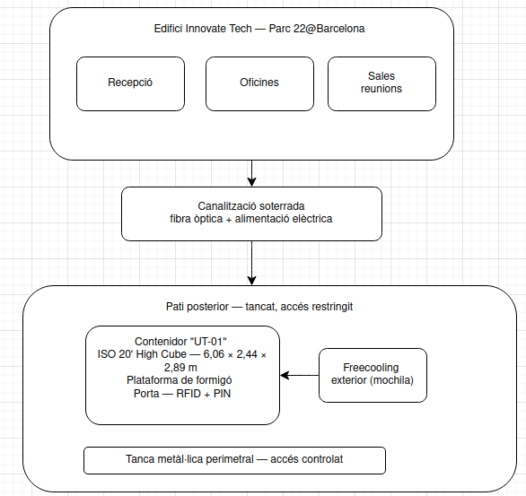**

## 

## 

## 

## 

## 

## 

## 

### **Planell interior — Vista planta**

## **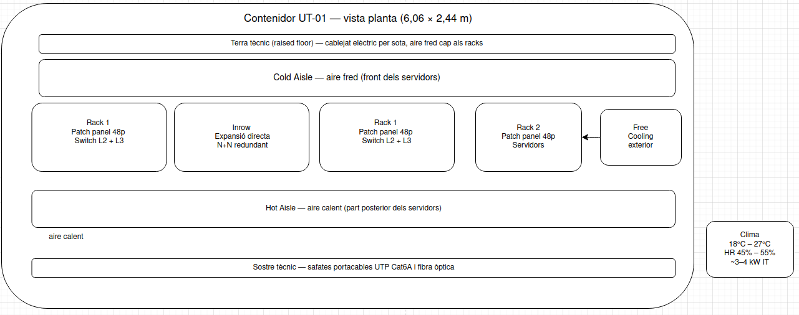**

### **Distribució i gestió del cablejat — codi de colors**

## **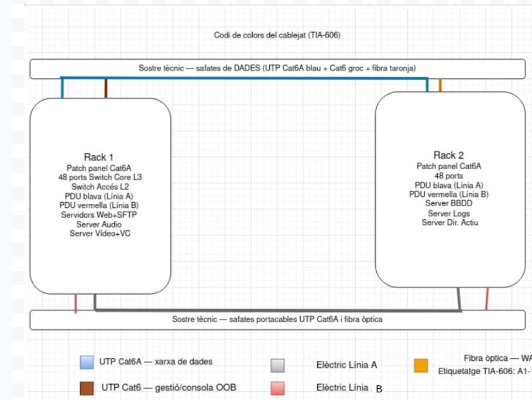**

### **Estructuració dels racks — Rack 1 i Rack 2**

## **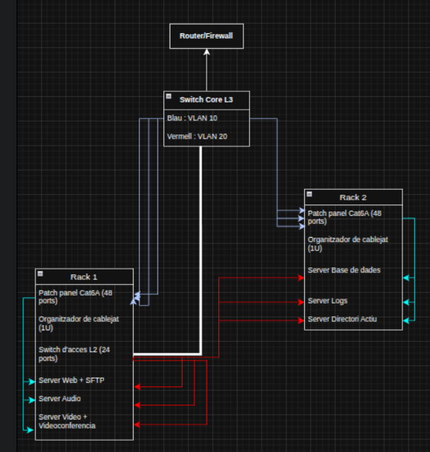**

## **Infraestructura IT**

InnovateTech té un total de 7 serveis en 6 servidos (Web i FTP estan al mateix servidor), tots els servidors corren sobre Ubuntu Server 24.04 LTS, per a això necessitem una bona organització i satisfacer els requeriments que es necessiten per un CPD. 

### **Servidors: Número i tipus de model:**

| Servei | Rol (Servei) | S.O base | Especificacions mínimes |
| :---: | :---: | :---: | :---: |
| **Web \+ FTP** | Nginx HTTPS Server \+ SFTP | Ubuntu Server 24.04 LTS | 2 vCPU, 16 GB RAM, 2TB HDD |
| **Audio** | Ampache | Ubuntu Server 24.04 LTS | 2 vCPU, 16 GB RAM, 1TB HDD |
| **Video \+ Videoconferencia** | NGINX-RTMP \+ Jitsi Meet | Ubuntu Server 24.04 LTS | 4 vCPU, 16 GB RAM, 1TB SSD |
| **Base de dades** | MySQL | Ubuntu Server 24.04 LTS | 4 vCPU, 16 GB RAM, 1TB SSD |
| **Centralització de logs** | Kibana \+ Elasticsearch \+ Logstash | Ubuntu Server 24.04 LTS | 4 vCPU, 8 GB RAM, 2TB HDD |
| **Directori Actiu** | Samba AD DC | Ubuntu Server 24.04 LTS | 2 vCPU, 4 GB RAM, 50 GB SSD |

### **Patch Panels:**

2 Patch panel Cat6A de 48 ports, que s’ubicaran al rack 1 i al rack 2\. Tindrem un organitzador de cables intermedis de 1U entre cada patch panel i el switch per mantenir l’ordre del cablejat. Etiquetatge de cada port seguint un estàndard, el TIA-606 que es basa en rack-posició-port.

### **Switches:**

Hem escollit 2 tipus de switches. Primer, tenim el Switch Core L3 (48 ports PoE, 4x SFP+ 10G uplink), aquest switch interconnectarà tots els racks i gestiona el routing entre VLANs.

- VLAN10: Servidors IT.   
- VLAN 20:Gestió/IPMI.   
- VLAN 30: Accès clients.   
- VLAN 99: Administració de xarxa.

 A continuació, tenim el 2n switch, el Switch d’accés L2 (24 ports):  
Aquest switch estarà dedicat exclusivament a la xarxa per a gestió i IPMI dels servidors, i, estarà completament segregat del tràfic de producció.

**Planells i diagrames de distribució de racks, patch panels i switches:**

***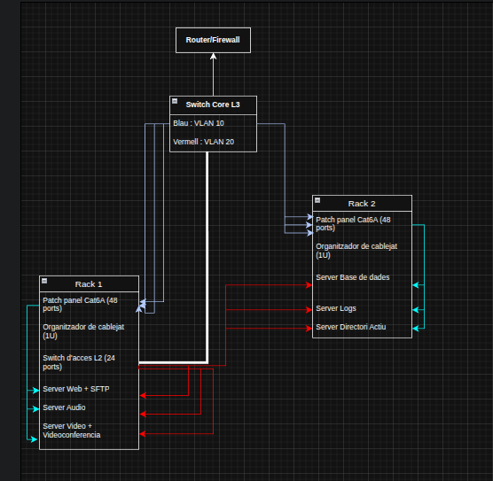*** 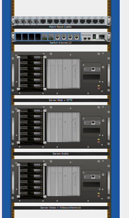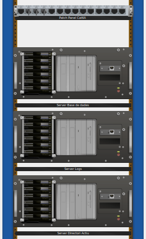

### 

## ***Infraestructura elèctrica***

### Sistemes d’alimentació redundant

#### **Estimació de consum elèctric**

##### **Consum pels servidors**

- Server Web \+ SFTP (Rack 1U, 2vCPU/4GB/50GB): 180-220W  
- Server Audio (Rack 1U, 2vCPU/4GB/100GB): 200-250W  
- Server Vídeo \+ Videoconferència (Rack 1U, 4vCPU/8GB/200GB): 280-350W  
- Server Base de Dades (Rack 1U, 4vCPU/8GB/200GB): 280-350W  
- Server Centralització de Logs (Rack 1U, 4vCPU/8GB/500GB): 280-350W  
- Server Directori Actiu (Rack 1U, 2vCPU/4GB/50GB): 180-220W  
- Estimació Total: 1400-1740 W.

  ##### **Consum de Xarxa i equipament complementari**

- Switch Core L3 (48 ports PoE, 4x SFP+ 10G): 150-200W  
- Switch d'Accés L2 (24 ports): 80-110W  
- Patch Panel Cat6A (48 ports) x2: 0W (equipment passiu)  
- Organitzador de cables: 0W (equipament passiu)  
- PDU Inteligent: 20-30W  
- Luminaria LED CPD: 100-150W  
- Estimació total: 350-490 W.

##### 	**Consum de climatització**

- Unitat Inrow (quan és necessari compressió frigorifica): 800-1200W  
- Free Cooling (aprofita condicions externes): redueix un 40-60 % el consum  
- Consum promig anual amb free cooling: 1200-2000   
- consum pic (clima calent, sense free cooling efectiu): 1500-2500 W  
- Estimació climatització: 1200-2500W (depenent de les condicions ambientals)

##### 	**Consum Total Operatiu**

- Servidors \+ xarxa: 1655 \- 2060W.  
- Climatització (operació normal): 1200-1800 W  
- Climatització (pic, condicions extremes): 1500-2500 W  
- Consum total : 2950-4030 W (Climatització normal) / 3250-4740 W (Condicions extremes)

Amb aquestes dades, per deduir quin SAI necessitem hem de considerar un marge de 25% sobre el consum màxim:

- Consum Màxim Pic: 4740 W  
- Marge de seguretat (25%): 1185 W

Total per dimensionament SAI: 5925 W  
Amb tota aquesta informació deduïm que necessitem un SAI de mínim 6 kVA (6000 W) per garantir funcionament i comoditat operativa dins dels serveis en cas d'emergència.

### SAIS

#### **Càlcul de bateria i components**

Per calcular la bateria necessaria i quin model hem d’escogir, hem fet 3 diferents escenaris en el que el SAI hauria de treballar.

**Escenari 1: Carga Normal (2500W \- Operació típica)**

- Autonomia estimada 25-30 mins.  
- Temps suficient per apagada ordenada completa de tots els servidors.  
- Permet executar scripts de backup i sincronització de dades.

**Escenari 2: Carga reduïda (1500W \- Apagada parcial)**

- Autonomia estimada: 45-60 mins.  
- Permet mantener servidors crítics (base de dades, AD) operatius mentre s’apaguen altres.

**Escenari 3: Carga Mínima (1.000W \- Serveis Critics només)**

- Autonomia estima: 90+ mins.  
-  Permet operació prolongada de servidors essencials.

#### **Model SAI**

Amb totes aquestes necessitats hem arribat a la conclusió d’escogir un SAI, el SAI que hem escollit el *APC SRT2200XLI* ([link compra](https://www.amazon.es/APC-Smart-UPS-SRT-alimentaci%C3%B3n-ininterrumpida/dp/B017WSRJ8I?th=1)), que té compleix amb els requeriments necessaris, aquestes son les caracterisitques del SAI:

* **Capacitat:** 3 kVA / 3.000W.  
* **Potencia bateria:** 2.700W.  
* **Rendiment:** 94,2%.  
* **Voltatge entrada:** 160-275V CA.  
* **Voltatge sortida:** 220V ±10%.  
* **Bateria:** VRLA Gel 48V / 9Ah (432 Wh) amb hot-swap.  
* **Autonomia:** \* 10-12 min plena carga  
  \* 20-25 min @ 70%  
  \* 35-40 min @ 50%  
  \* 60+ min @ 25%  
* **Salides:** 6 × C13 \+ 1 × C19.  
* **Ports:** USB, RJ-45 SNMP, RS-232, SmartSlot.  
* **Temps transferència:** \< 4ms.  
* **Proteccions:** sobrecarga, apagado emergència, alarma audible.  
* **Dimensiones:** 483 × 177 × 432 mm.  
* **Peso:** 35 kg.  
* **Temperatura operativa:** 0-40°C.  
* **Certificacions:** CE, RoHS, ENERGY STAR, EN/IEC 62040\.  
* **Garantia:** 5 anys.  
* **Preu:** (1954,49€ x2) 3908,98€

## ***Seguretat fisica i lògica***

### **Fisica:**

Els elements de la part de seguretat del CPD es basen en 3 capes:  
La Capa 1 és el perímetre exterior del pati, que disposa d'una tanca metàl·lica i d'una porta d'accés amb pany electrònic i videoporter. Només el personal autoritzat pot entrar al pati. L'accés des del carrer no permet veure l'interior del pati ni identificar el contenidor.  
La Capa 2 és la porta d'accés al contenidor amb doble factor. La porta del contenidor és d'acer reforçat i requereix doble autenticació: s'utilitzaria una targeta RFID, de la qual només disposen les persones autoritzades, i el sistema registra l'usuari que hi ha accedit juntament amb la data i l'hora de l'accés. I també amb un teclat PIN, ja que si no saps quin és el codi, és igual que tinguis la targeta perquè no podràs accedir-hi. Als 3 intents incorrectes es genera una alerta automàtica.  
La Capa 3 és una gàbia de seguretat dins del contenidor, on estaran els dos racks protegits. Per accedir a l'interior de la gàbia fa falta una clau, de manera que, encara que siguis capaç de travessar les capes anteriors, encara queda travessar la gàbia.

Pel que fa a la part de videovigilància, s'instal·larien 4 càmeres (la primera a l'entrada del pati interior, la segona a la porta del contenidor a l'exterior, la tercera a l'interior del contenidor a la cantonada dreta i la quarta a l'interior del contenidor a la cantonada esquerra en paral·lel a la tercera). Les característiques de les càmeres són:  
·Resolució 1080p Full HD com a mínim.  
·Visió nocturna per infrarojos.  
·Gravació contínua 24/7.  
·Emmagatzematge en NVR amb disc de 6 TB, amb una retenció de 30 dies de gravació.  
·Accés remot a les gravacions exclusivament mitjançant VPN, només disponible en els ordinadors del responsable de seguretat.

El sistema de prevenció, detecció i extinció d'incendis es basa en:  
**Prevenció:** amb la prohibició total d'introduir líquids, aliments o materials inflamables dins del contenidor. Els equips es revisen periòdicament per detectar sobreescalfaments abans que siguin perillosos i el contenidor no té paper, ni cartó, ni cap altre material combustible a l'interior.  
**Detecció:** amb 2 detectors de fum iònics al sostre del contenidor (un a sobre de cada rack), amb una sensibilitat alta per detectar partícules de fum abans que hi hagi flames visibles. També inclou 1 detector de temperatura integrat al sistema de climatització que activa una alarma si se supera el llindar de temperatura establert en 30 °C, 1 detector d’humitat amb un rang establert entre el 45% i el 55% per evitar la condensació d'aigua o l'electricitat estàtica que podrien fer malbé els components electrònics dels servidors , juntament amb una central d'alarmes connectada a tots els detectors de fum i de temperatura que notifica el responsable en cas d'alarma.  
**Extinció:** és un sistema automàtic d'extinció per gas inert que, en activar-se, allibera un gas que redueix l'oxigen per sota del nivell de combustió, apagant el foc sense danyar els equips ni deixar residus. És l'estàndard per a CPD i és compatible amb espais tancats. També disposa de 2 extintors de CO₂ (tipus C), un a l'interior al costat de la porta i un altre a l'exterior del contenidor, per a una intervenció manual.  
**Vies d'evacuació:** La via principal és la porta principal, que des de l'interior s'obre sense necessitat d'introduir codis ni res.  
**Senyalització d'emergència:** Està instal·lada sobre la porta interior i és visible fins i tot amb fum. És autònoma, disposa de la seva pròpia bateria i s'activa automàticament si hi ha talls de llum.  
**Enllumenat d'emergència:** Se situa a sobre de la porta interior i té una autonomia de 1 hora en cas de tall elèctric.  
**Protocol d'evacuació:** Estableix que tot el personal que treballi a l'interior ha de saber que, davant de qualsevol alarma, ha de sortir immediatament, allunyar-se del contenidor un mínim de 10 metres i avisar el responsable de seguretat. No s'ha d'intentar apagar el foc manualment si el sistema automàtic ja està activat.

Diagrama de la seguretat  
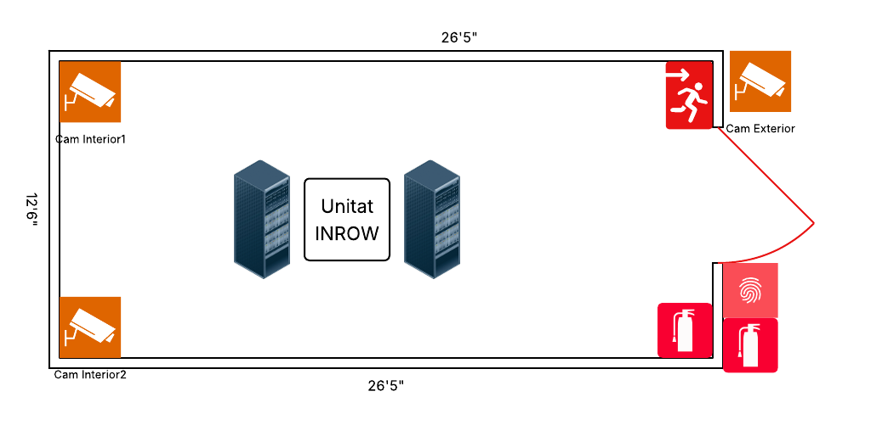

### **Lógica**:

Per a la restricció d'accés per autorització s'aplicarà el principi de mínim privilegi. Cada usuari té els permisos limitats i exclusivament necessaris per al seu rol. Dins dels servidors Linux, cap servei funcionarà amb l'usuari root, sinó cadascun exclusivament amb l'usuari del sistema necessari. Els administradors tindran el seu propi usuari intransferible i sense possibilitat d'accedir remotament amb SSH sense clau pública/privada. I totes les comandes executades amb privilegis queden guardades al servidor de logs.

A nivell de firewall en tindrem un de físic i un altre de host. El físic servirà per obrir exclusivament els ports necessaris que es puguin obrir cap a internet, com per exemple l'HTTPS. Després, el firewall de host servirà per si de cas el físic ha tingut alguna fallada de seguretat, limitant també les connexions amb iptables, com ara restringint que només es pugui fer SSH dins de la xarxa interna i res que sigui extern.

Per al monitoratge s'utilitzarà Zabbix, perquè podem centralitzar tota la supervisió des d'un mateix servidor. Es monitoritza el hardware (temperatura de la CPU, ús de RAM i CPU, per exemple), els serveis (MySQL o LDAP, per exemple), la xarxa (latència, amplada de banda, etc.) i la seguretat (intents fallits de login per SSH, per exemple). Tot això anirà juntament amb un sistema d'alertes si alguna mètrica canvia dràsticament. Com per exemple: més d'un 90% d'ús de CPU durant un temps prolongat, més de 5 intents d'SSH en 1 minut, etc.

Amb les còpies de seguretat s'aplicarà l'estratègia 3-2-1. Atès que es considera l'estàndard, serà la que farem servir. Aquesta consta de 3 còpies de les dades en 2 tipus de suport diferents, amb 1 còpia fora de les instal·lacions. Faríem una còpia incremental diària a les 2 del matí, una còpia completa setmanal tots els diumenges a les 3 del matí i una còpia completa mensual el día 1 de cada mes.

Per als RAID utilitzaríem RAID 10\. La configuració seria de 6 discs SSD de 4 TB, un total de 24 TB; es formen els parells mirall del RAID 1 i després es combinen en RAID 0 per al rendiment. La capacitat útil seria de 12 TB. S'afegiria un 7è disc com a hot spare (disc de reserva en calent); si un disc falla, el sistema es reconstrueix automàticament amb aquest disc shadow hagué d'esperar la intervenció humana.

### **Prevenció de RRLL:**

**Risc elèctric** Tot el cablejat elèctric discorre pel fals terra tècnic, separat físicament del cablejat de dades. Està prohibit realitzar treballs elèctrics sense formació específica i sense desconnectar prèviament l'equip afectat. S'aplica el procediment de bloqueig i etiquetatge abans de qualsevol intervenció elèctrica.

**Risc per descàrrega del sistema d'extinció** El sistema de gas inert té un retard d'activació de 30 segons des que sona l'alarma, temps suficient per sortir del contenidor. Està prohibit entrar al contenidor després d'una descàrrega fins que el responsable de seguretat confirmi que el nivell d'oxigen és segur mitjançant un mesurador de O₂.

**Risc ergonòmic i de sobreesforç** Cap equip de més de 25kg no es manipula per una sola persona, sempre es requereix un mínim de dues persones. Es disposa d'un carret elevador de rack per a la instal·lació d'equips pesats.

**Risc per exposició al soroll** Els sistemes de climatització i els ventiladors dels servidors generen soroll constant. Si supera els 85 dB és obligatori l'ús de protectors auditius. Es limita la permanència contínua dins del contenidor a un màxim de 2 hores seguides.

**Risc per temperatura** Si la temperatura supera els 30°C està prohibit romandre dins del contenidor fins que es restableixi la climatització.

**Risc de caiguda**

Qualsevol placa del fals terra que es retiri durant un treball ha de senyalitzar-se immediatament amb un senyal d'advertència i col·locar-se de nou en acabar la intervenció.

**Formació i procediments generals** Tot el personal amb accés al CPD rep una formació inicial de seguretat abans d'obtenir la targeta d'accés, que inclou: protocol d'evacuació, maneig de l'extintor de CO₂, protocol després de descàrrega de gas i normes elèctriques bàsiques.

## 

## ***Implementació del CPD***

# 

### **Servidor Web \+ SFTP:**

**Servidor Web i Transferència de Fitxers Segura (SFTP)**

## ***Introducció i Context del Projecte***

* Aquest apartat detalla la implementació, el desplegament i la configuració del servidor corporatiu d'**Innovate Tech**. Dins del marc del projecte transversal , s'ha optat per una solució altament optimitzada i orientada al núvol que unifica el **Servidor Web actiu** i el **Servei de Transferència Segura de Fitxers (SFTP)** dins d'una mateixa instància d'Amazon Web Services (AWS).  
* Aquest servidor actua com el nucli d'interconnexió frontal i d'APIs del projecte, enllaçant dinàmicament la capa d'aplicació amb proveïdors externs de dades com bases de dades distribuïdes, serveis d'autenticació i nodes de logs centralitzats

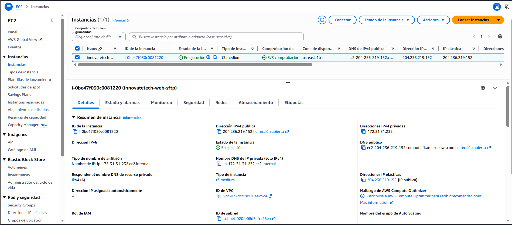

***Arquitectura de l'Aplicació i Stack Tecnològic***

A diferència d'un desplegament estàtic tradicional, la infraestructura actual d'Innovate Tech dona suport a un entorn web dinàmic modern dividit en microserveis controlats per un gestor de processos:

* **Domini Actiu:** https://innovatetech.ddns.net (Associat mitjançant No-IP).  
  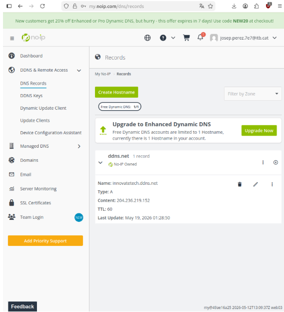  
* **Frontend d'Alt Rendiment:** Desenvolupat en React \+ TanStack Start \+ Vite, executant-se com un procés Node.js gestionat per PM2 a la instància EC2 d'AWS.   
* **Backend / API Interna:** Dissenyada amb *Node.js* i *Express API* per a la gestió lògica del negoci.  
* **Gestor de Processos:** *PM2* s'encarrega de mantenir vius i monitorar en segon pla els dos serveis principals en els següents ports locals:  
  * innovatetech (Frontend) $\rightarrow$ Port 3000  
  * api (API Express) $\rightarrow$ Port 4000

***Preparació i Seguretat Inicial del Sistema (Hardening)***

Per complir rigorosament amb els requeriments d'administració segura del CPD d'Innovate Tech, s'ha prohibit de manera absoluta l'ús de l'usuari per defecte (ubuntu) per a tasques d'administració web, minimitzant així els vectors d'atac.

**Creació de l'Usuari Administrador de Serveis**

S'ha creat un usuari dedicat del sistema anomenat adminweb. Per dotar-lo de persistència d'accés sense comprometre el servidor amb contrasenyes febles, s'ha configurat un esquema de clau pública/privada (SSH):

**Configuració de l'entorn de claus segures:** Es va extreure el fitxer authorized\_keys original de l'entorn d'AWS i es va replicar aplicant estrictament els permisos POSIX de propietat i lectura restrictiva: 

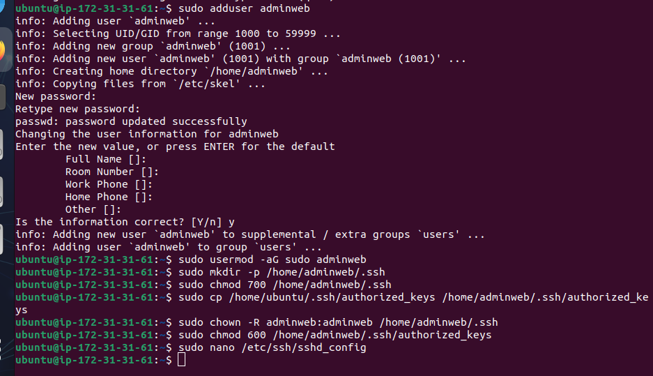  
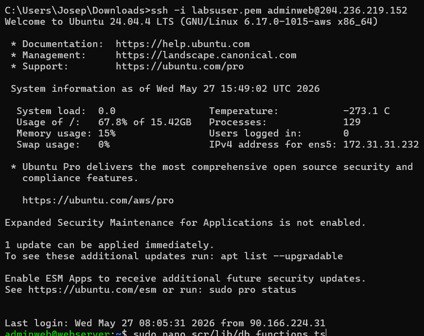

**Creació de la Pàgina Web**

La pàgina web corporativa d'Innovate Tech ha estat creada utilitzant Lovable, una eina de generació de codi web basada en intel·ligència artificial. Gràcies a aquesta eina, el frontend va estar operatiu des del primer moment, ja que Lovable va generat automàticament tota l'estructura de components React, el disseny visual i la navegació entre seccions.

Un cop generada la base del projecte, la tasca principal va consistir a substituir les parts simulades o estàtiques per connexions reals amb els servidors del projecte. Concretament, es van adaptar els components que mostraven dades de prova per tal que consumissin els endpoints reals de l'API Express, el servidor d'àudio Ampache, el servidor de vídeo, el sistema d'autenticació via Samba AD i el monitor de logs d'Elasticsearch.

D'aquesta manera, Lovable va permetre centrar els esforços en la integració real dels serveis en lloc d'invertir temps en el disseny i la maquetació del frontend.

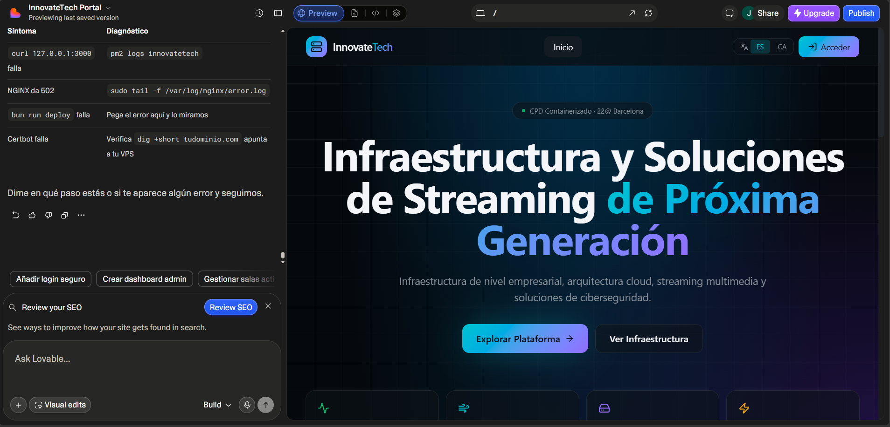  
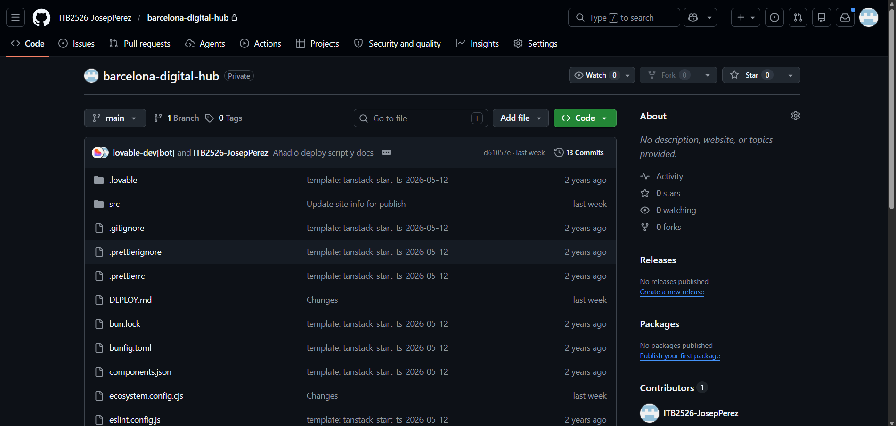

***Estructura i Funcionalitats del Portal Web***

El portal web corporatiu d'Innovate Tech està dividit en quatre seccions principals accessibles des del menú de navegació superior.

**Inici** és la pàgina principal de la plataforma. Mostra una presentació general de l'empresa i dona accés ràpid a les funcionalitats principals mitjançant botons d'acció.

**Àudio** és el portal de streaming d'àudio. Mostra el catàleg de cançons disponibles al servidor Ampache amb el títol, durada, categoria i format. Permet reproduir les pistes directament des del navegador mitjançant un reproductor integrat.

**Vídeo** és el portal de vídeo i videoconferència. Mostra el catàleg de vídeos disponibles al servidor de vídeo i permet crear o unir-se a sales de videoconferència Jitsi directament des del navegador.

**Panel Admin** és el panell d'administració de la infraestructura. Només és accessible per als usuaris amb rol Administrador. Conté quatre pestanyes: Monitor de Logs per veure els events del sistema en temps real des d'Elasticsearch, SFTP per gestionar les transferències de fitxers, Samba AD per crear i gestionar els usuaris del directori actiu, i Bandwidth per monitorar les mesures d'amplada de banda de la xarxa.

**Control d'accés per rols**

La web implementa un sistema de control d'accés basat en rols. Els usuaris amb rol Administrador tenen accés a totes les seccions incloent el Panel Admin. Els usuaris amb rol Empleado només poden accedir a Inici, Àudio i Vídeo, i el Panel Admin no apareix al seu menú de navegació. Els rols s'assignen a la base de dades MySQL i es validen en el moment de l'autenticació contra Samba AD.

**Servei Web**

El servidor web d'Innovate Tech actua com el punt d'accés principal de tota la infraestructura del projecte. És l'encarregat de rebre totes les peticions dels usuaris i redirigir-les als serveis corresponents mitjançant NGINX com a proxy invers. El portal web corporatiu permet als usuaris autenticats accedir a tots els serveis de l'empresa des d'un único lloc: el portal d'àudio, el portal de vídeo i videoconferència, el panell d'administració i la gestió d'usuaris.

El servidor és accessible públicament a través del domini [https://innovatetech.ddns.net](https://innovatetech.ddns.net), associat mitjançant No-IP per resoldre el problema de l'adreça IP pública dinàmica d'AWS. Totes les comunicacions es realitzen xifrades mitjançant HTTPS gràcies al certificat SSL/TLS obtingut amb Certbot i Let's Encrypt.

**Servei SFTP**

El servei SFTP permet als usuaris de l'empresa transferir fitxers de manera segura al servidor. A diferència d'un servei FTP tradicional, totes les comunicacions van xifrades, cosa que garanteix la confidencialitat de les dades transferides.

S'han implementat dos nivells d'accés. El primer és mitjançant un usuari local específic (sftptest) per a transferències puntuals o de prova. El segon és mitjançant els usuaris del directori actiu Samba AD, de manera que qualsevol empleat de l'empresa pot connectar-se per SFTP utilitzant les mateixes credencials que utilitza per accedir a la resta de serveis corporatius, sense necessitat de gestionar comptes locals addicionals.

Els usuaris SFTP estan confinats dins del seu directori mitjançant chroot, cosa que impedeix que puguin navegar per altres directoris del servidor i garanteix la seguretat del sistema.

**NGINX**

S'ha escollit NGINX com a servidor web i proxy invers per la seva alta eficiència en la gestió de connexions concurrents i el seu baix consum de recursos en comparació amb altres alternatives com Apache. NGINX actua com a punt d'entrada únic de totes les peticions HTTP/HTTPS, redirigint el tràfic cap als serveis interns segons la ruta sol·licitada. Això permet tenir el frontend i la API en ports locals separats sense exposar-los directament a Internet.

**PM2**

PM2 és un gestor de processos per a aplicacions Node.js que garanteix que els serveis estiguin sempre actius. En cas que un procés caigui per qualsevol error, PM2 el reinicia automàticament. A més, permet monitorar l'estat dels processos en temps real i configurar l'inici automàtic dels serveis quan el servidor s'arrenca. S'ha utilitzat per mantenir en funcionament tant el frontend (port 3000\) com la API Express (port 4000).

**Certbot / Let's Encrypt**

Per servir la web amb HTTPS s'ha utilitzat Certbot amb Let's Encrypt, una autoritat de certificació gratuïta i de confiança. Això permet xifrar tot el tràfic entre el client i el servidor sense cost addicional. El certificat té una validesa de 90 dies i es pot renovar automàticament, cosa que elimina la necessitat de gestió manual.

**OpenSSH (SFTP)**

S'ha utilitzat OpenSSH per implementar el servei SFTP ja que ve instal·lat per defecte a Ubuntu Server 24.04 LTS i ofereix un nivell de seguretat molt alt. A diferència d'FTP, SFTP xifra tant les credencials com les dades transferides, cosa essencial en un entorn empresarial. A més, la integració amb el directori actiu Samba AD mitjançant sssd permet que els usuaris del domini es connectin per SFTP sense necessitat de crear comptes locals addicionals.

**API Express — Nucli de Connexió dels Serveis** El servidor web no només serveix el frontend, sinó que també allotja una API REST desenvolupada amb Node.js i Express que actua com a intermediari entre la web i tots els servidors del projecte. Aquesta API escolta al port 4000 i és accessible des de l'exterior a través de NGINX mitjançant la ruta /api-internal/.

El flux complet és el següent: el navegador de l'usuari fa una petició al domini [https://innovatetech.ddns.net](https://innovatetech.ddns.net), NGINX la rep i la redirigeix segons la ruta, el frontend al port 3000 o l'API al port 4000, i l'API connecta amb els servidors externs necessaris per respondre.

El fitxer principal de l'API és /var/www/innovatetech/api/index.js, que gestiona les connexions amb MySQL per a las dades dels usuaris, salas i mesures d'amplada de banda, amb Samba AD via LDAP per a l'autenticació, amb Ampache per obtenir el catàleg d'àudio, amb Elasticsearch per obtenir els logs del sistema i amb el servidor de vídeo per obtenir el catàleg de vídeos.

Per la seva banda, el fitxer db.functions.ts del frontend actua com a pont entre els components React i l'API Express. Centralitza totes les crides als serveis i defineix les constants de configuració principals, la URL de l'API interna i la IP del servidor d'àudio. Cada funció d'aquest fitxer correspon a una operació concreta: getAllState obté totes les dades necessàries per als portals, login gestiona l'autenticació, uploadMedia registra fitxers pujats per SFTP, createUser crea usuaris simultàniament a MySQL i Samba AD, createRoom i endRoom gestionen les videoconferències, getBandwidth obté les mesures de xarxa i getVideos obté el catàleg de vídeos del servidor extern.

***Instal·lació i configuració del servidor web (NGINX \+ HTTPS)***

El servidor web s'ha instal·lat sobre Ubuntu Server 24.04 LTS a AWS. S'ha utilitzat NGINX com a servidor web i proxy invers, amb certificat SSL/TLS per servir la web amb HTTPS.

Els passos seguits han estat:

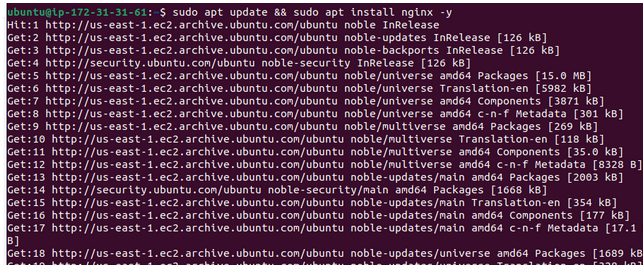

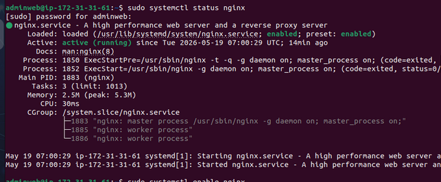

Per obtenir el certificat HTTPS s'ha utilitzat Certbot amb Let's Encrypt:

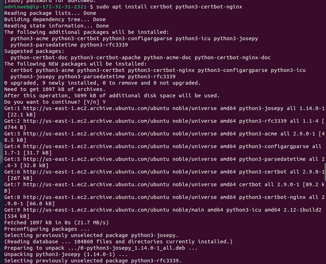

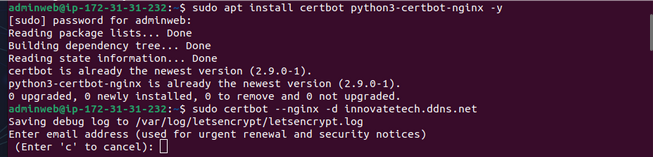

La configuració final de NGINX actua com a proxy invers cap al servidor d'aplicació (Wrangler/Node.js) que escolta al port 3000\.

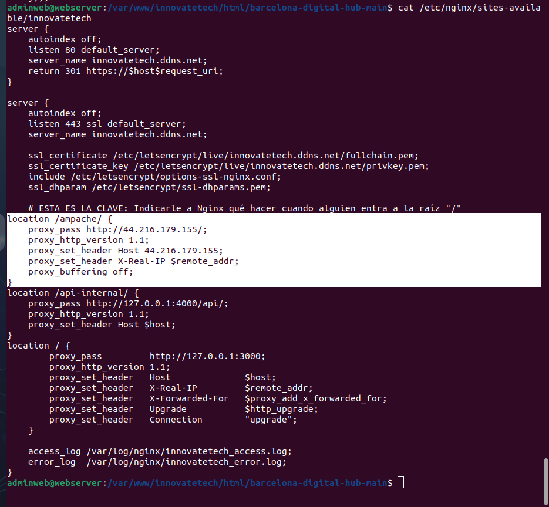

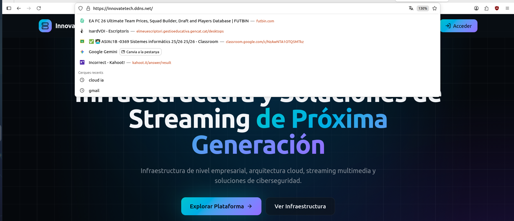

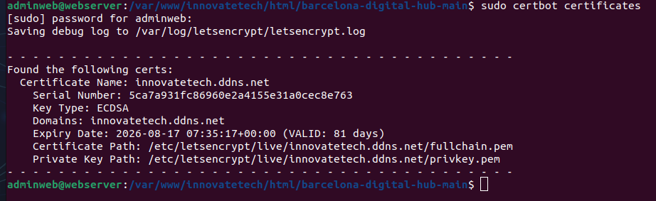

***Instal·lació i configuració del servei SFTP***

El servei SFTP permet la transferència segura de fitxers als usuaris autenticats. S'ha configurat utilitzant OpenSSH, que ja ve instal·lat per defecte a Ubuntu Server 24.04 LTS.

S'ha creat un usuari específic per SFTP i un directori d'uploads:

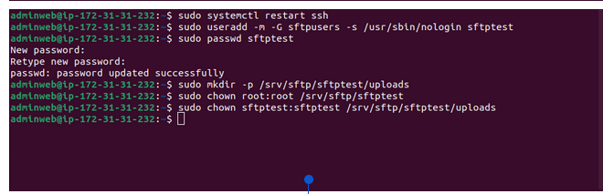

Explicació de la Configuració del Fitxer sshd\_config

Per configurar el servei SFTP s'han afegit les següents directives al fitxer /etc/ssh/sshd\_config:

**DenyUsers ubuntu**

S'ha denegat l'accés SSH a l'usuari per defecte d'Ubuntu per reduir els vectors d'atac. Això obliga a utilitzar l'usuari administrador específic (adminweb) per a qualsevol tasca d'administració del servidor.

**Subsystem sftp internal-sftp**

S'ha substituït el subsistema SFTP per defecte pel mode internal-sftp, que és més eficient i permet aplicar restriccions de chroot correctament sense dependre de binaris externs.

**Match Group sftpusers**

S'ha creat una regla específica que s'aplica únicament als usuaris que pertanyen al grup sftpusers. Dins d'aquesta regla s'han configurat les següents opcions:

* **ChrootDirectory /srv/sftp/%u** — Cada usuari queda confinat dins del seu propi directori, on %u és substituït automàticament pel nom d'usuari. Això impedeix que pugui accedir a altres parts del sistema de fitxers.  
* **ForceCommand internal-sftp** — Força que la connexió només pugui utilitzar SFTP, impedint que l'usuari pugui obrir una sessió SSH normal o executar comandes al servidor.  
* **PasswordAuthentication yes** — Permet l'autenticació amb contrasenya per als usuaris SFTP, necessari per als usuaris del domini Samba AD.  
* **X11Forwarding no / AllowTcpForwarding no** — Es desactiven funcionalitats innecessàries per reduir la superfície d'atac del servei.

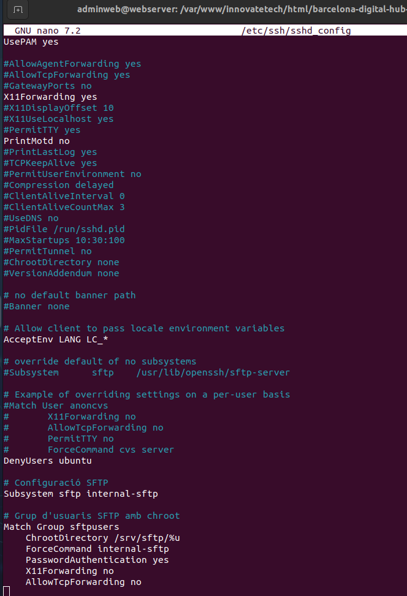

Després s'ha reiniciat el servei:

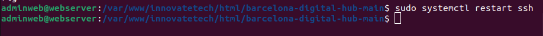

Per verificar el funcionament s'ha connectat des d'un client extern:

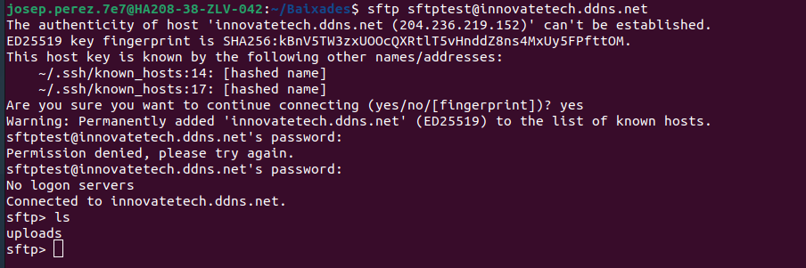

Transferència d'un fitxer de prova amb put ubicacio\_fisica\_cpd.md

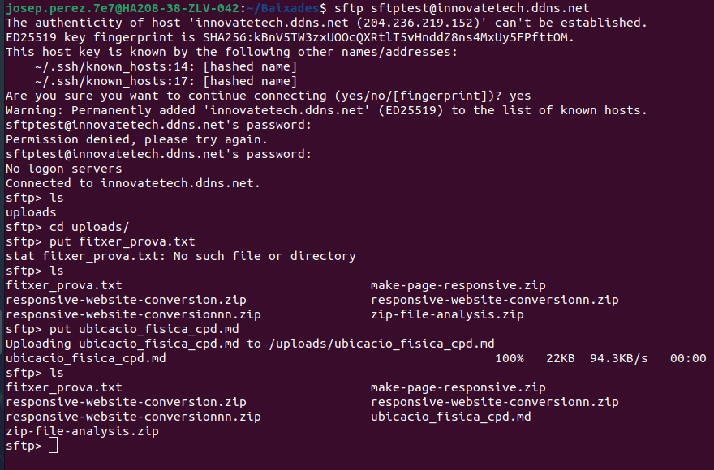

**3\. Instal·lació i configuració del servei SFTP amb autenticació Samba AD**

El servei SFTP permet la transferència segura de fitxers als usuaris de l'empresa. S'ha configurat utilitzant OpenSSH integrat amb el Directori Actiu (Samba AD) mitjançant sssd i realmd, de manera que els mateixos usuaris del domini poden connectar-se per SFTP sense necessitat de crear comptes locals addicionals.

***Integració amb Samba AD:***

Per integrar el servidor amb el domini innovatetech.local s'han instal·lat els paquets necessaris: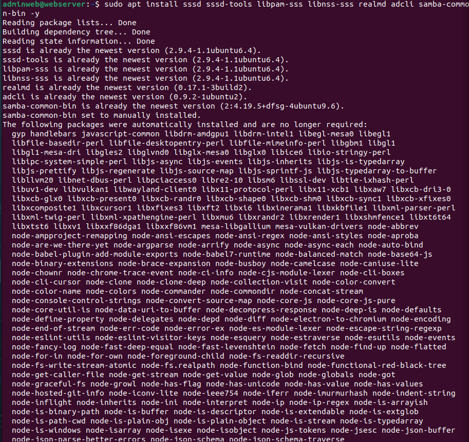

S'ha unit el servidor al domini:

S'ha generat el keytab de Kerberos:

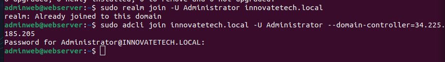

S'ha configurat /etc/sssd/sssd.conf:

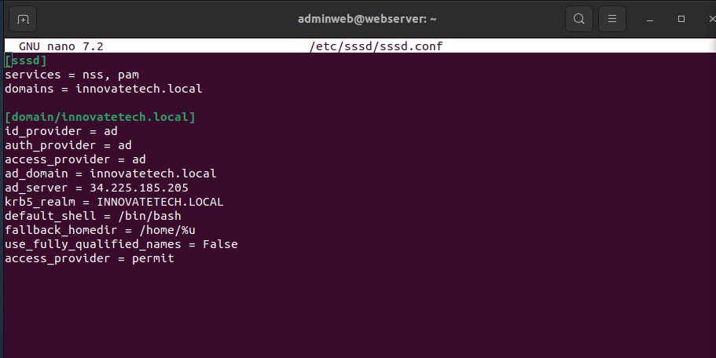

Els directoris home es creen automàticament en el primer login:

***Verificació Final del Servei SFTP amb Autenticació Samba AD***

Un cop completada la integració del servidor SFTP amb el directori actiu Samba AD mitjançant sssd i realmd, s'ha verificat que els usuaris del domini innovatetech.local poden connectar-se per SFTP utilitzant les seves credencials corporatives, sense necessitat de tenir un compte local creat manualment al servidor.

Això és possible gràcies a la integració de sssd amb PAM, que intercepta l'autenticació i la delega al controlador de domini Samba AD. Quan un usuari del domini intenta connectar-se per SFTP, el servidor consulta al directori actiu si les credencials són vàlides i si l'usuari té permisos d'accés. A més, gràcies a la configuració de pam-auth-update amb l'opció mkhomedir, el directori home de l'usuari es crea automàticament la primera vegada que es connecta, sense que l'administrador hagi d'intervenir manualment.

Els avantatges principals d'aquesta integració són els següents. La gestió centralitzada d'usuaris permet que qualsevol canvi realitzat al directori actiu, com bloquejar un usuari o canviar la seva contrasenya, tingui efecte immediat també al servei SFTP. Els usuaris utilitzen les mateixes credencials per a tots els serveis de l'empresa. No cal crear ni mantenir comptes locals addicionals al servidor web, cosa que simplifica l'administració i redueix el risc d'errors.

**Comprovació:** 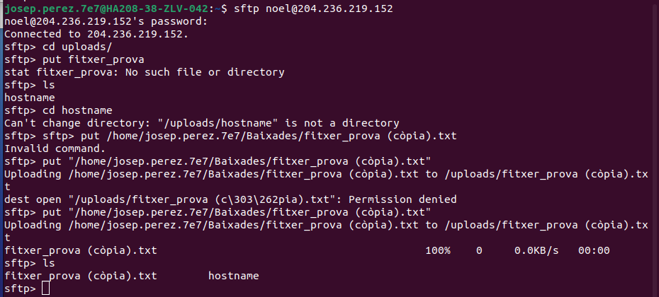

***Servidor de Vídeo i Videoconferència (NGINX-RTMP \+ Jitsi Meet)***

El servidor de vídeo i videoconferència ha estat instal·lat i configurat pel company Noel en un servidor AWS independent. El servei és accessible a https://innovatetech-video.duckdns.org i utilitza el protocol WebRTC per a la comunicació en temps real.

**Verificació d'accessibilitat del servidor:** 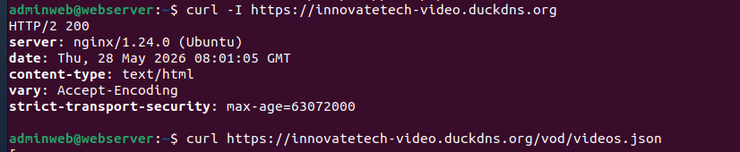

Catàleg de vídeos disponibles: 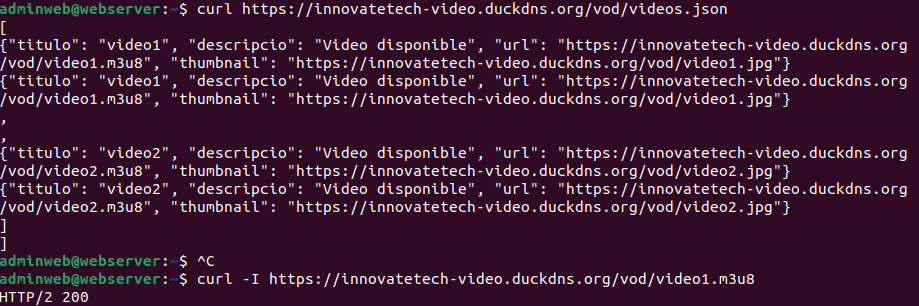

Verificació del stream HLS: 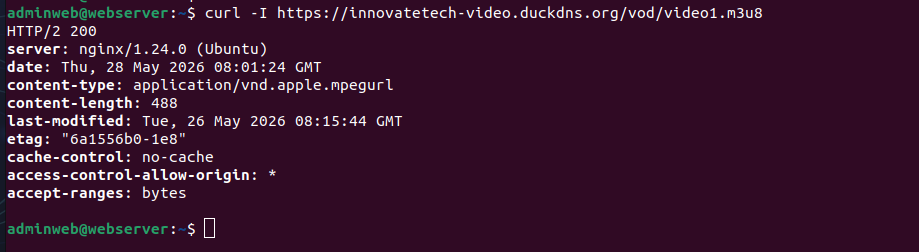

**Integració del servidor de vídeo a la web — Josep**

S'ha creat un endpoint a l'API Express que obté el catàleg de vídeos i el retorna a la web: 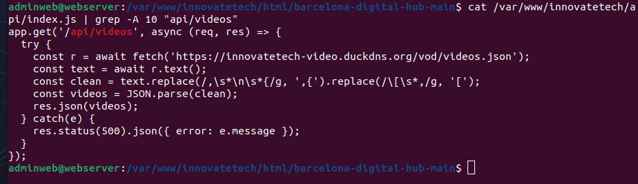

Verificació: 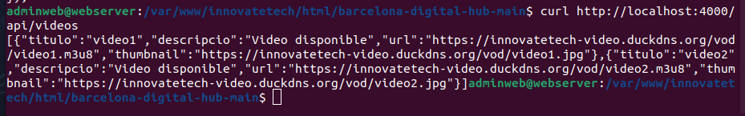

**Integració amb el servidor web**

La part de Josep ha consistit en connectar el portal web corporatiu amb el servidor Jitsi mitjançant un iframe, i crear l'API que registra les trucades a MySQL. Quan...
